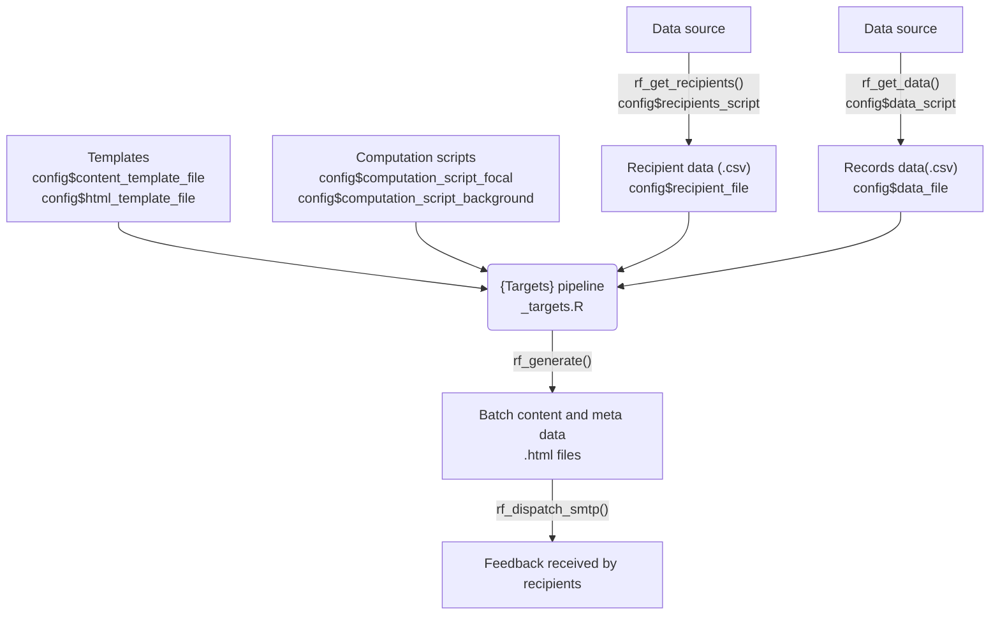

# recorderFeedback

**recorderFeedback** is an R package for generating personalised, data-driven feedback, originally designed for citizen science wildlife recording but adaptable to other domains. The package provides tools to set up a feedback workflow, load data, generate content, and distribute feedback to recipients.

## Features

- **Project Initialisation**: Quickly scaffold a new feedback project with all necessary files and folders.
- **Data Loading**: Import recipient and observation data from configurable sources.
- **Computation**: Run custom analyses or summaries on your data before generating feedback.
- **Content Rendering**: Create personalised feedback documents for each recipient using RMarkdown templates.
- **Batch Processing**: Automate feedback generation for multiple recipients.
- **Email Dispatch**: Send feedback via email using SMTP.

Package functions are prefixed with `rf_`.

## Installation

Install from GitHub using `devtools`:

```r
devtools::install_github("simonrolph/recorderFeedback")
```

## Quick Start

When you initialise a project with `rf_init()`, files are copied to set up your workflow, ensuring you have all the necessary templates, scripts, and configuration to get started quickly.

 * `config.yml`: The central configuration file referenced in the README, where you set paths and options for your project.
 * `scripts/computation.R`, `scripts/get_data.R`, `scripts/get_recipients.R`: Scripts for loading data, recipients, and running computations, matching the workflow steps outlined in the README.
 * `templates/content.Rmd`, `templates/email_format.R`, `templates/template.html`: Templates for rendering the feedback and formatting emails
 * `run_pipeline.R`, `_targets.R`: Pipeline orchestration scripts, supporting batch processing and automation
 
 
This diagram attempts to explain how it fits together:
 


Key terms:

 - Recipient: someone to receive feedback
 - Focal/background: whether the data relates to the recipient (focal), or not (background)
 - Template: a RMarkdown document defining how the data is manipulated and visualised
 - Computations: calculations or other processing done on the raw data prior to rendering them template

```{r quick_start}
library(recorderFeedback)

#initialise a new project
rf_init(path = "example")
config <- config::get()

#get recipients
rf_get_recipients()
knitr::kable(head(read.csv(config$recipients_file)))

#get data
rf_get_data()
knitr::kable(head(read.csv(config$data_file)))

#verify the data is all good
rf_verify_data(T)

#render a single feedback item
rf_render_single(recipient_id = 1)

# run the pipeline
batch_id <- "test_batch"
rf_render_all(batch_id)

#view the meta table
meta_table <- read.csv(file.path("renders",batch_id,"/meta_table.csv"))
knitr::kable(head(meta_table))

#verify the batch
rf_verify_batch(batch_id)
#view content
#rf_view_content(batch_id = batch_id,recipient_id = 3)

#send the emails
#rf_dispatch_smtp(batch_id)
```

## Handling errors

If rendering a template fails the pipeline will continue, but you won't have a `.html` file in the designated `renders/[batch_id]` folder. Using `rf_verify_batch()` will show you for which recipients the rendering failed. Using `targets::tar_meta(fields = "error")` will also tell you which targets failed and the corresponding error messages. Use `render_single(recipient_id)` to render an individual feedback item and view the detailed error message that is shown.

```{r cleanup, echo = FALSE}
setwd("C:/Users/simrol/OneDrive - UKCEH/R_onedrive/R_2025/recorderFeedback")
unlink("example", recursive=TRUE)
unlink("example")
```

