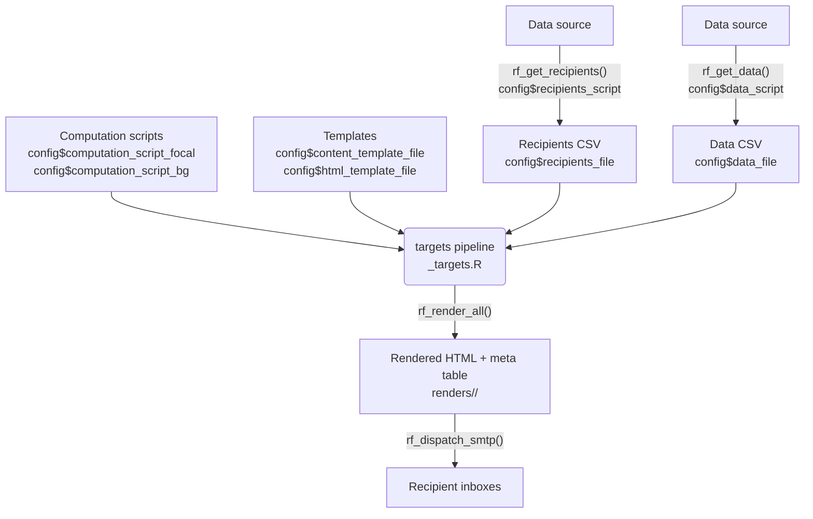

# recorderFeedback

`r badger::badge_devel("BiologicalRecordsCentre/recorderFeedback", "blue")` `r badger::badge_github_actions("BiologicalRecordsCentre/recorderFeedback","R-CMD-check.yaml")`

`recorderFeedback` is an R package for generating personalised, data-driven feedback.

It was built for wildlife recording and citizen science projects, where teams want to give contributors useful feedback to participants to boost engagement.

This package helps turn that into a repeatable workflow in R, using the power of R packages for data processing and visualisation.

## Why it exists

In many recording schemes, data arrives continuously but feedback to contributors is irregular. The bottleneck is usually time: preparing personalised feedback manually does not scale.

`recorderFeedback` provides a practical way to close that gap, so contributors hear back consistently rather than occasionally. This does not intend to replace peer-to-peer or personal feedback, but to complement it with regular, data-driven updates at scale.

## In practice

With `recorderFeedback`, you can build a workdow that runs on a schedule (e.g. monthly) to:

- collate data about recipients and their records from an external data source (e.g. your database or an API))
- compute recipient-level summaries
- render personalised feedback as HTML files
- dispatch feedback by email

It was designed for wildlife recording and citizen science, but the workflow is general and can be adapted to other domains.

All exported functions are prefixed with `rf_`.

## Core functions

The package provides a clear set of functions for running this workflow from start to finish:

- `rf_init()` scaffolds a project structure and starter files.
- `rf_get_recipients()` and `rf_get_data()` populate your `data/` inputs.
- `rf_verify_data()` and `rf_preflight()` catch problems early.
- `rf_render_single()` and `rf_render_all()` generate recipient content.
- `rf_verify_batch()` and `rf_view_content()` help QA outputs.
- `rf_dispatch_smtp()` sends emails with dry-run, resume, retries, and rate limiting.

## Workflow at a glance

After `rf_init()`, your project includes:

- `config.yml`: central settings (file paths, templates, email options, test mode)
- `scripts/`: data retrieval and computation scripts you customize
- `templates/content.Rmd`: per-recipient feedback template
- `templates/template.html`: optional HTML wrapper
- `_targets.R` and `run_pipeline.R`: batch orchestration
- `renders/`: output folder for rendered files and dispatch logs

## Installation

Install from GitHub:

```r
devtools::install_github("simonrolph/recorderFeedback")
```

## Quick Start

### 1. Create a new feedback project

```r
library(recorderFeedback)

# Creates a new folder with config, scripts, templates, and pipeline files
rf_init(path = "my_feedback_project")
```

Then open `my_feedback_project/config.yml` and update paths/settings for your use case.

### 2. Customize your scripts and template

Edit the scaffolded files:

- `scripts/get_recipients.R` to write `data/recipients.csv`
- `scripts/get_data.R` to write `data/data.csv`
- `scripts/computation.R` for your derived variables and summaries
- `templates/content.Rmd` for the feedback content recipients will receive

### 3. Run the workflow

```r
library(recorderFeedback)

# Pull / refresh input files
rf_get_recipients()
rf_get_data()

# Validate data and required project files
rf_verify_data(verbose = TRUE)
rf_preflight(stage = "render")

# Render one recipient while iterating on template content
rf_render_single(recipient_id = 1)

# Render a full batch
batch_id <- "2026_03_example"
rf_render_all(batch_id = batch_id)

# Check what rendered and what failed/skipped
rf_verify_batch(batch_id)
# rf_view_content(batch_id, recipient_id = 1)
```

### 4. Dispatch safely

```r
# Validate without sending
rf_dispatch_smtp(batch_id, dry_run = TRUE)

# In test_mode = TRUE, sends only to mail_test_recipient
rf_dispatch_smtp(batch_id)

# Required confirmation when test_mode = FALSE
# rf_dispatch_smtp(batch_id, confirm_live_send = TRUE)
```

## Pipeline diagram


```mermaid
graph TD
    A[Data source] --> |"rf_get_recipients()<br>config$recipients_script" | B["Recipients CSV<br>config$recipients_file"]
    C[Data source] --> |"rf_get_data()<br>config$data_script" | D["Data CSV<br>config$data_file"]
    H["Computation scripts<br>config$computation_script_focal<br>config$computation_script_bg"] --> E
    F["Templates<br>config$content_template_file<br>config$html_template_file"] --> E
    B --> E("targets pipeline<br>_targets.R")
    D --> E
    E --> |"rf_render_all()"| G["Rendered HTML + meta table<br>renders/<batch_id>/"]
    G --> |"rf_dispatch_smtp()"| J[Recipient inboxes]
```

## Key terms


- Recipient: a person or account receiving a feedback output.
- Focal data: records associated with the specific recipient.
- Background data: context records not tied to one recipient.
- Template: the `Rmd` file that turns data into recipient-specific content.
- Batch: one run of `rf_render_all()`, identified by `batch_id`.

## Dispatch safety and observability

`rf_dispatch_smtp()` now writes dispatch artifacts per batch:

- `renders/<batch_id>/dispatch_log.csv`: one row per send attempt.
- `renders/<batch_id>/dispatch_summary.csv`: run-level summary metrics.

Recommended send sequence:

1. Keep `test_mode: TRUE` in `config.yml`.
2. Run `rf_dispatch_smtp(batch_id, dry_run = TRUE)` to validate rows and files.
3. Run `rf_dispatch_smtp(batch_id)` for test-recipient sends.
4. Switch to `test_mode: FALSE` only when ready, and use
    `rf_dispatch_smtp(batch_id, confirm_live_send = TRUE)`.

If a run is interrupted, rerun with `resume = TRUE` to skip recipients already
marked as `Success` in `dispatch_log.csv`.

Campaign controls:

- `mail_subject_template` supports recipient/campaign variables, e.g.
    `"{{campaign_name}} update for {{name}}"`.
- `mail_body_prefix_template` / `mail_body_suffix_template` inject optional HTML
    around each rendered email using the same template variables.
- `mail_attachments_col` / `mail_inline_images_col` define optional
    `meta_table.csv` columns with per-recipient file paths for attachments and
    inline media.
- `preview_only` with `preview_n` or `preview_recipient_ids` writes sampled
    previews to `renders/<batch_id>/dispatch_preview/`.

## Selective Rendering

You can render content for only a subset of recipients by defining `recipient_select()` in the script referenced by `config$recipient_select_script`.
The function receives the recipients table, the full data table, and the active config, and should return either a logical vector, a vector of recipient IDs to keep, or a data frame with `recipient_id`, `selected`, and optional `skip_reason` columns.

Recipients excluded by this function are written to `meta_table.csv` with `render_status = "skipped"`, so they remain visible in the batch audit trail but are not rendered or dispatched.

## Handling errors

If rendering a template fails the pipeline will continue, but you won't have a `.html` file in the designated `renders/[batch_id]` folder. Using `rf_verify_batch()` will show you for which recipients the rendering failed. Using `targets::tar_meta(fields = "error")` will also tell you which targets failed and the corresponding error messages. Use `rf_render_single(recipient_id)` to render an individual feedback item and view the detailed error message that is shown.

Data QA in `rf_verify_data()` now includes:

- duplicate `recipient_id` detection
- missing/invalid email checks
- optional recorder schema checks for columns like `date`, `species`, and `site`

Use `rf_preflight(stage = "dispatch", batch_id = "my_batch")` to fail fast before dispatch.

